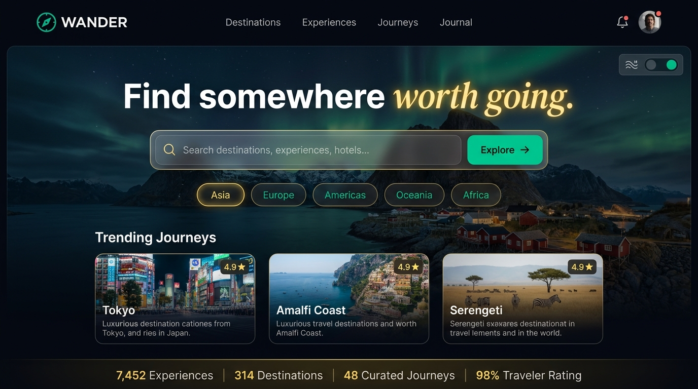
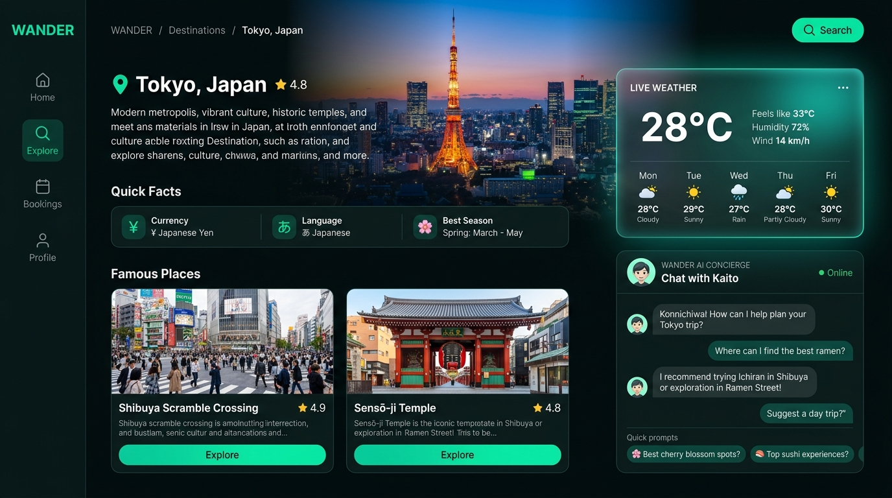
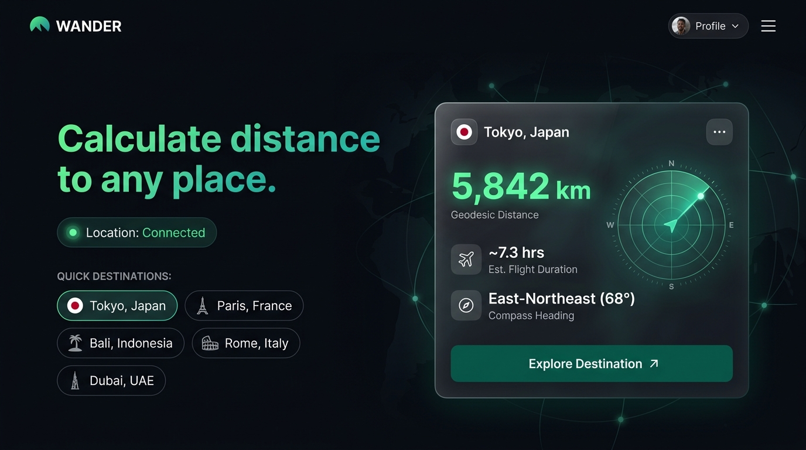
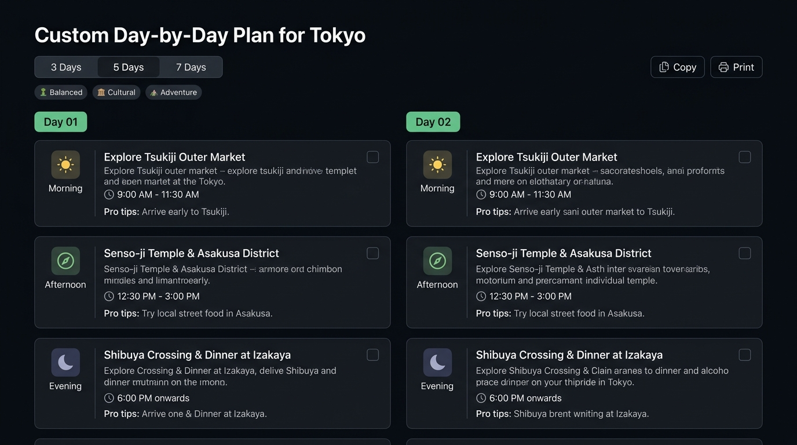

# 🌍 WANDER — Editorial World Travel & AI Concierge

A modern, design-led travel web application built with React and Vite. WANDER helps travelers explore world destinations, monitor real-time weather, discover famous landmarks, calculate geodesic distances from their current location, and generate tailored day-by-day itineraries with the help of Google Gemini AI.

## 🚀 Live Demo

👉 [Open WANDER Live](https://wander-travel-1p0xtpa6l-reddiobulesh.vercel.app/)

## 💻 GitHub Repository

👉 [View Source Code](https://github.com/Reddiobulesh/wander-travel)

---

## 📸 Application Screenshots

### 1. 🎬 Landing Experience & Ambient Video Hero


### 2. ☀️ Destination Details, Live Weather & AI Concierge


### 3. 📍 Real-Time Location Radar & Geodesic Distance Calculation


### 4. 📅 Interactive Day-by-Day Itinerary Planner


---

## ✨ Features

- 🎬 **Ambient Video Landing Experience** — Autoplaying, looping background video with live ambience switcher (Tropical Coast, Metropolis Lights, Ocean Waves) and audio controls.
- 🗺️ **Destination Explorer & Filter System** — Multi-dimensional search by city, country, or landmark, with Continent filter pills and Travel Vibe category chips.
- 📍 **Real-Time Geodesic Distance Radar** — Browser geolocation calculating direct distance in kilometers to any world destination, flight duration in hours, and compass headings with an animated radar sweep graphic.
- ☀️ **Live Weather Integration** — Keyless Open-Meteo API fetching real-time temperature readings, °C / °F unit toggle, feels-like temperature, humidity, wind speed, and a 5-day visual forecast strip.
- 🏛️ **Famous Places Landmark Grid** — Rich visual cards with numbered index badges, category tags, dynamic photography, and interactive visitor tip modals with keyboard `Escape` support.
- 🤖 **Wander AI Conversational Concierge** — AI assistant connected to Google Gemini (`gemini-3.6-flash`) for tailored local guidance, recommended dining, best visiting seasons, and a built-in offline intelligence fallback.
- 📅 **Interactive Day-by-Day Itinerary Planner** — Structured multi-day plans (3, 5, or 7 days) categorized into Morning, Afternoon, and Evening activities with checkable completion boxes, pro tips, and Copy/Print actions.
- ♿ **Accessibility & Micro-Interactions** — Semantic HTML5 markup, WCAG AAA compliant contrast ratios, visible keyboard `:focus-visible` rings, and `prefers-reduced-motion` support.

---

## 🛠️ Technologies Used

| Technology | Purpose |
|---|---|
| **React 19** | Component-driven user interface architecture |
| **Vite 8** | High-performance frontend build tooling and local development server |
| **JavaScript (ES6+)** | Application logic, state management, and asynchronous API integrations |
| **HTML5** | Semantic structure, accessible landmarks, and native looping video |
| **CSS3** | Vanilla CSS design tokens, glassmorphism, responsive grids, and keyframe animations |
| **React Router v6** | Client-side single-page application routing and deep-linking |
| **Lucide React** | Clean, minimalist SVG icons |
| **Google Gemini API** | Natural language processing, travel Q&A, and customized trip planning |
| **Open-Meteo API** | Real-time meteorological data and multi-day forecasts |
| **Unsplash API** | Dynamic high-resolution travel and landmark photography |

---

## 🌐 APIs Used

### 1. Open-Meteo Weather API
Provides real-time atmospheric data and multi-day forecasts without requiring an API key.
- **Portal**: [https://open-meteo.com/](https://open-meteo.com/)
- **Features Used**: Current temperature, feels-like temperature, humidity percentage, wind speed, weather code conditions, and daily min/max forecasts.

### 2. Google Gemini API (`gemini-3.6-flash`)
Powers the Wander AI conversational assistant and customized itinerary generation.
- **Portal**: [https://aistudio.google.com/](https://aistudio.google.com/)
- **Features Used**: Natural language prompt generation, travel recommendations, and structured trip suggestions with fallback local intelligence.

### 3. Unsplash API
Provides dynamic, high-resolution photography for world destinations and famous landmarks.
- **Portal**: [https://unsplash.com/developers](https://unsplash.com/developers)
- **Features Used**: Dynamic photo search queries, author attribution, and high-definition image source URLs.

---

## ⚙️ How to Run Locally

### 1. Clone the Repository
```bash
git clone https://github.com/Reddiobulesh/wander-travel.git
```

### 2. Open the Project
```bash
cd wander-travel
```

### 3. Install Dependencies
```bash
npm install
```

### 4. Configure Environment Variables
Create a `.env` file in the project root:
```env
# Unsplash Developer Key (https://unsplash.com/developers)
VITE_UNSPLASH_ACCESS_KEY=your_unsplash_access_key

# Google Gemini API Key (https://aistudio.google.com/apikey)
VITE_GEMINI_API_KEY=your_gemini_api_key
```
> **Security Reminder**: Do not commit your `.env` file to GitHub. Keep it in `.gitignore`.

### 5. Start the Development Server
```bash
npm run dev
```
The application will be available at:
```text
http://localhost:5173
```

### 6. Create a Production Build
```bash
npm run build
```

### 7. Preview the Production Build
```bash
npm run preview
```

---

## 🔐 API Key Security

All API keys are loaded securely through Vite's `import.meta.env` and kept strictly out of version control.

The `.env` file is excluded in `.gitignore`:
```gitignore
node_modules/
dist/
.env
.env.local
.env.*.local
```

A clean template [`c:\Users\reddi\wander-travel\.env.example`](file:///c:/Users/reddi/wander-travel/.env.example) is provided in the repository for reviewers. Never publish your actual API keys to GitHub.

---

## 📱 Responsive Design

WANDER is designed to provide a seamless, premium experience across all devices:

- 📱 **Mobile (< 480px)**: Single-column responsive layout, touch-friendly tap targets, swipeable category chips, and zero horizontal scrolling.
- 📲 **Tablet (480px – 1024px)**: Adaptive 2-column destination cards, collapsible navigation drawer, and balanced weather widgets.
- 💻 **Desktop (> 1024px)**: Multi-column destination grids, side-by-side weather & AI concierge, and panoramic ambient video heroes.

---

## 🎨 User Interface

WANDER includes:
- Editorial navigation header with transparent glassmorphism and quick links
- Ambient video hero with live scene switcher (Coast, Metropolis, Waves)
- Geodesic Distance Radar with circular animated radar sweep and crosshairs
- Multi-dimensional destination search with Continent & Vibe filter pills
- Destination details view with quick travel facts (Currency, Language, Best Season)
- Famous places cards with category tags, index badges, and modal visitor guides
- Live weather card with °C/°F unit toggle and 5-day forecast strip
- Wander AI conversational chat drawer with quick suggestion chips
- Checkable day-by-day trip planner with duration toggles (3, 5, 7 days)
- Professional dark obsidian aesthetic with accessible contrast

---

## 📂 Project Structure

```text
wander-travel/
│
├── public/
│   ├── favicon.svg
│   └── screenshots/
│
├── screenshots/
│   ├── hero-preview.jpg
│   ├── details-preview.jpg
│   ├── radar-preview.jpg
│   └── itinerary-preview.jpg
│
├── src/
│   ├── components/
│   │   ├── AIChat.jsx
│   │   ├── DestinationCard.jsx
│   │   ├── Footer.jsx
│   │   ├── Hero.jsx
│   │   ├── Itinerary.jsx
│   │   ├── Loading.jsx
│   │   ├── LocationBanner.jsx
│   │   ├── Navbar.jsx
│   │   ├── PlaceCard.jsx
│   │   └── WeatherCard.jsx
│   │
│   ├── data/
│   │   └── destinations.js
│   │
│   ├── hooks/
│   │   └── useImage.js
│   │
│   ├── pages/
│   │   ├── DestinationDetails.jsx
│   │   ├── Explore.jsx
│   │   └── Home.jsx
│   │
│   ├── services/
│   │   ├── aiService.js
│   │   ├── imageService.js
│   │   └── weatherService.js
│   │
│   ├── utils/
│   │   └── distance.js
│   │
│   ├── App.css
│   ├── App.jsx
│   ├── index.css
│   └── main.jsx
│
├── .env
├── .env.example
├── .gitignore
├── index.html
├── package.json
├── package-lock.json
├── README.md
└── vite.config.js
```

---

## 🚀 Production Deployment

WANDER is optimized for deployment on modern frontend hosting platforms like Vercel:

```text
Development ──> React + Vite ──> GitHub ──> Vercel ──> Live WANDER Application
```

After deploying, add your live URL to the **Live Demo** section at the top of this README.

---

## 🧪 Application Testing

The application has been verified for:
- [x] Multi-keyword search across cities, countries, and landmarks
- [x] Continent filter pills and Travel Vibe category filtering
- [x] Real-time Geodesic distance calculation and flight hours
- [x] Live Open-Meteo weather fetching and °C / °F unit toggle
- [x] Famous place photo rendering and visitor guide modal
- [x] Modal keyboard closing via `Escape` key
- [x] Google Gemini AI conversational responses (`gemini-3.6-flash`)
- [x] Local fallback travel intelligence when offline
- [x] Day-by-day itinerary duration toggling (3, 5, 7 days)
- [x] Checkable itinerary activities (`Space` / `Enter` keyboard accessible)
- [x] Ambient video playback and live theme switching
- [x] Zero console errors and clean production build (`npm run build`)

---

## 👨‍💻 Project

**WANDER**  
An editorial world travel web application created to demonstrate modern frontend architecture, multi-API integration, responsive UI design, accessibility, and conversational AI.

## 📄 License

MIT License. © 2026 WANDER Travel. All rights reserved.
